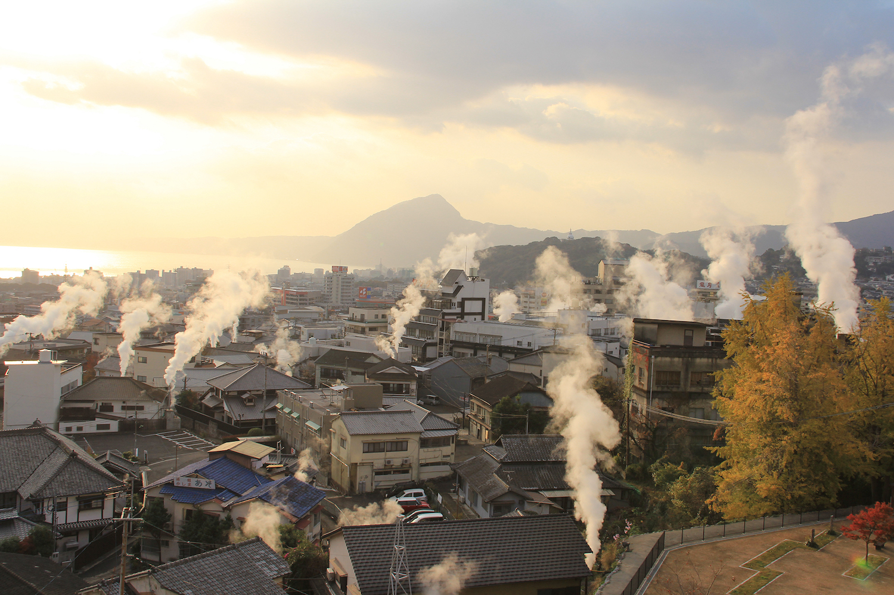

Beppu, Japan - [Google maps](https://www.google.com/maps/place/Beppu,+Oita,+Japan/@33.2893063,131.3795391,12z/data=!3m1!4b1!4m6!3m5!1s0x3546a618509f24c7:0x89c8f818256b6722!8m2!3d33.2844614!4d131.4907093!16zL20vMDF3cXlw?entry=ttu).
---

---
Beppu is a city and spa resort on the southern Japanese island of Kyushu. Set between Beppu Bay and volcanic mountains, it's home to more than 2,000 onsen (hot springs). Kannawa Onsen district has facilities for bathing in nutrient-rich water, mud and sand.